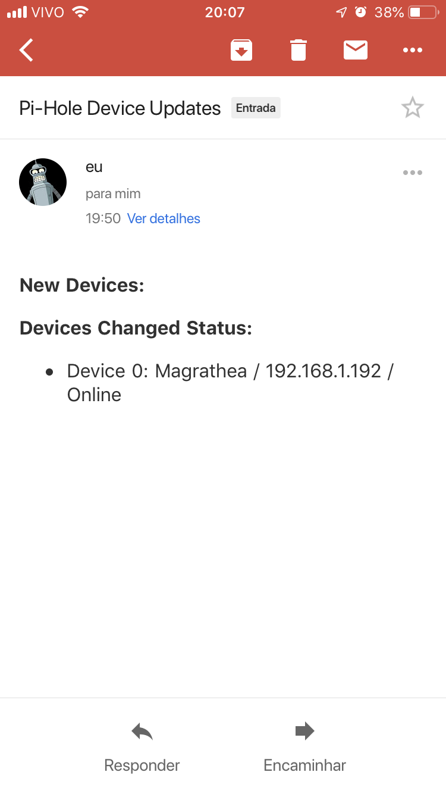
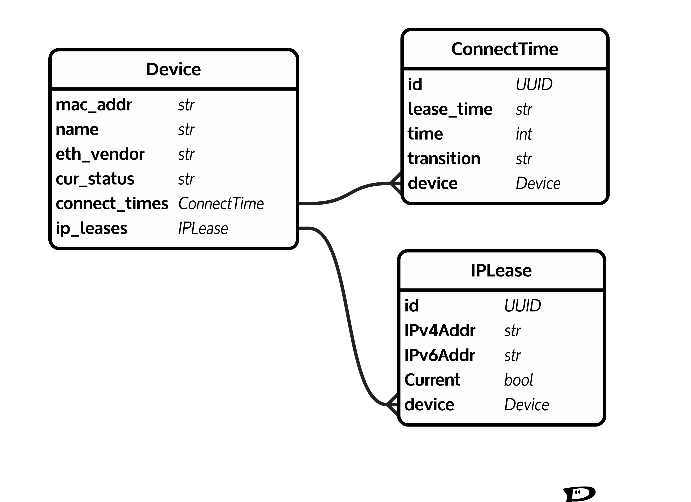

# WhoIsConnected

[](https://www.codacy.com/app/abaruchi/WhoIsConnected?utm_source=github.com&utm_medium=referral&utm_content=abaruchi/WhoIsConnected&utm_campaign=Badge_Coverage) [](https://www.codacy.com/app/abaruchi/WhoIsConnected?utm_source=github.com&amp;utm_medium=referral&amp;utm_content=abaruchi/WhoIsConnected&amp;utm_campaign=Badge_Grade) [](https://opensource.org/licenses/mit-license.php) 

## Contents
1. [Introduction](#introduction)
2. [How to Install](#how-to-install)
3. [Implementation Details](#implementation-details)
4. [How to Contribute](#How-to-contribute)


## Introduction
This is another personal project that aims to detect new connections on my home network and warn me about it. I installed some time ago a raspiberry as DNS and DHCP ([Pi-Hole](https://pi-hole.net/)). So, I wanted to be aware of which devices was being connected, disconnected and for how long it was using my network. Of course that checking the DHCP log file I could get this kind of data, but I wanted to organize it in a database and be able to follow the connection and see the history of all connections.

The WhoIsConnected project aims to warn the user about devices using his network. Any of conditions bellow, the user will receive an email:
- New devices: Any device(s) that was never connected to the network;
- Status Change: If any device goes online or offline.  





## How to Install
For now, just clone this repository and run the script `runner.py`.

- Clone this repository
```bash****
$ git clone https://github.com/abaruchi/WhoIsConnected.git
```

- Install all requirements.
```bash
$ pip install -r requirements.txt
```

- Customize a `config.ini`. There is an example which you can copy and change according to your needs. 
```bash
$ cp -p config_example.ini config.ini
$ vi config.ini
```
This configuration file you can set your email address, pooling time, where the DHCP file is located and so on.

- Run the `runner.py` script.
```bash
$ python runner.py
```

Since this is script run as a daemon, you will not receive any message (even error messages). Since all devices inside DHCP file will not be stored in SQLite database, you should receive an email after the firs run with a list of **New Devices**.

### Dependencies
This project was written in Python 3.6, so you should run it using Python > 3. Also, all dependencies are listed in `requirements.txt` file.


## Implementation Details

### Pony ORM and DB Design
As database it was used SQLite3, cause it is running in a raspberry, but it can be easily changed to a more robust database. The database design is quite simple (as shown bellow) and is composed by three tables:

- _Device Table:_ Contains main information about the Device connected. The mac address is used as primary key, the device name is the hostname configured by the host (pi-hole do not set hostname) and we get the ethernet vendor (refer to routine `get_mac_vendor()` in `utils/network.py`);
- _ConnectTime Table:_ This table is used to keep tracking of the transition (offline to online) and the lease time. This table can be used to plot the transitions of a device over the time; 
- _IPLease Table:_ This table contains data regarding the IP Address of a given device and the current status of this device (Online or Offline).

The idea of this tables is to keep tracking of all activities of a given device. In future we plan to add plotting module to the project and why not some Machine Learning module. 



### Code Structure
The code is structured in the following directories:

- `core/`: Contains code related to database models and views. Also, the default path for the SQLite file;

- `sql_schema/`: Contains the SQL Commands to create the database tables. It is not used by any script, it is just an information file;

- `tests/`: Contains Unit Tests for the project;

- `utils/`: Contains scripts related to specific tasks, such as send email, check device status, read the config file and so on.


## How to Contribute
As any Open Source project, you can contribute solving issues, reporting bugs and improvements. Just clone the repo and submit your pull request to me.
Since it is a project that Im coding in my free time, this will not be as fast as I wish. 